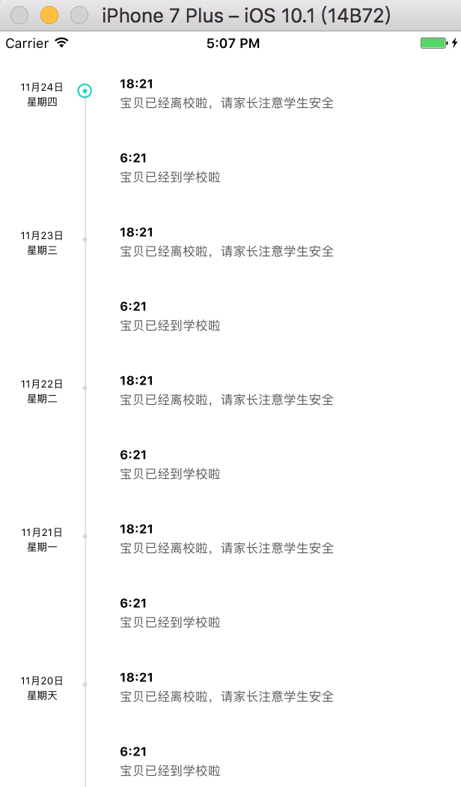
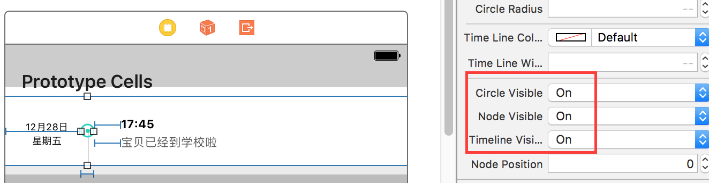

# iOS 时间线控件

一个 iOS 时间线控件，用于构建类似如下的时间线的效果。

## 用法

使用时，直接将 TimeLineView.h/.m 源文件拖到你的 Xcode 项目中。
在故事版中，拖入一个 UIView，将 Class 改为 TimeLineView。设置好它的自动布局约束，并参照下图修改对应属性：

## 定制

TimeLineView 继承了 UIView 并重载了 drawRect: 方法。你可以通过下列属性定制TimeLineView ：

* UIColor* circleColor - 空心圆圈的绘制颜色
* CGFloat nodeRadius - 实心圆点的半径
* CGFloat circleStrokeWidth - 空心圆圈的线宽
* CGFloat circleRadius - 空心圆圈的半径
* UIColor* timeLineColor - 时间线的颜色
* CGFloat timeLineWidth - 时间线的线宽
* BOOL circleVisible - 是否绘制空心圆圈，默认 NO
* BOOL nodeVisible - 是否绘制实心圆点，默认 NO
* BOOL timelineVisible - 是否绘制时间线，默认 NO
* CGFloat nodePosition - 节点绘制位置，相对于整个长度的比例，0-1，默认 0.5

## Demo

用 Xcode 8 打开 TimeLineDemo.xcodeproj。这里演示了如何通过自定义 UITableViewCell（TimeLine.cell） 和 TimeLineView 实现完整的时间线效果。

有任何问题和建议，请与[作者](kmyhy@126.com)联系。

